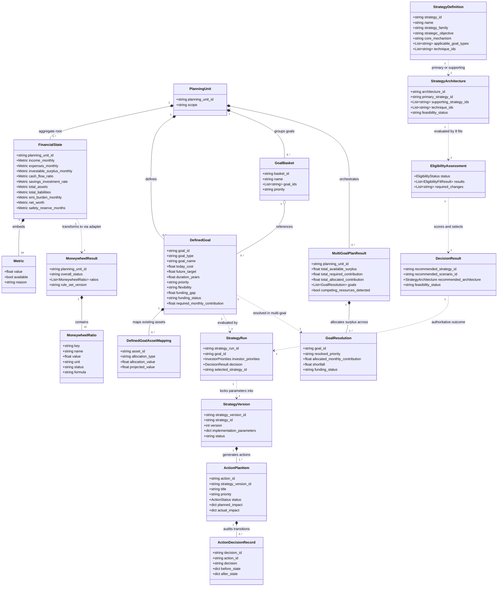

# Planvesto Backend & Docs — Code-First Domain Ontology Audit

> **Audit Context:** Derived strictly from the current implementation of `backend/` (`models/`, `schemas/`, `rules/`, `engines/`, `services/`, `library/`, `api/`, `data/`, `tests/`) and `docs/` on branch `backend-audit-cleanup`.
> **Audit Principle:** Code-first truth. No business rules have been invented, and no architecture has been redesigned. Inconsistencies, duplicates, and conflicts are reported explicitly with exact source file and symbol evidence.

---

## 1. Entity Dictionary

This dictionary catalogs every domain entity and value object identified across the codebase, mapped with its attributes, types, lifecycle state, exact file and class evidence, and ontological classification (`CANONICAL | DUPLICATED | CONFLICTING | IMPLICIT | MISSING | UNUSED`).

| Entity / Value Object | Kind | Status | Key Attributes & Types | Exact Code Evidence | Responsibility & Description |
|---|---|---|---|---|---|
| **`FinancialState`** | Entity | `CANONICAL` | `scope: str`<br>`planning_unit_id: str`<br>`investor_id: str \| None`<br>`income_monthly: Metric`<br>`income_annual: Metric`<br>`income_breakdown: list[dict]`<br>`expenses_monthly: Metric`<br>`expenses_annual: Metric`<br>`expense_breakdown: list[dict]`<br>`investable_surplus_monthly: Metric`<br>`investable_surplus_annual: Metric`<br>`cash_flow_ratio: Metric`<br>`savings_investment_rate: Metric`<br>`total_assets: Metric`<br>`asset_breakdown: list[dict]`<br>`asset_allocation: list[dict]`<br>`liquidity_breakdown: list[dict]`<br>`total_liabilities: Metric`<br>`liability_breakdown: list[dict]`<br>`liability_allocation: list[dict]`<br>`emi_burden_monthly: Metric`<br>`net_worth: Metric`<br>`safety_reserve_months: Metric`<br>`safety_reserve_required_amount: Metric` | `backend/models/financial_state.py`<br>Class `FinancialState` (L11-L36)<br>`backend/engines/financial_state/engine.py`<br>Class `FinancialStateEngine` (L10-L150) | The single authoritative aggregate root representing the quantitative financial position of a planning unit or individual. |
| **`Metric`** | Value Object | `CANONICAL` | `value: float \| None`<br>`available: bool`<br>`reason: str \| None` | `backend/models/financial_state.py`<br>Class `Metric` (L5-L9) | Standard 3-field value object wrapping every calculated financial measure to gracefully handle missing inputs. |
| **`FinancialStateRequest`** | Schema | `CANONICAL` | `planning_unit_id: str`<br>`scope: Literal['family', 'individual']`<br>`investor_id: str \| None` | `backend/schemas/financial_state.py`<br>Class `FinancialStateRequest` (L6-L10) | Request contract for querying or calculating a financial state aggregate. |
| **`FinancialRatioConstraintEvaluator` / `RatioConstraintAssessment`** | Value Object | `CANONICAL` / `DUPLICATED` | `ratios: dict[str, FinancialRatioResult]`<br>`checks: dict[str, ConstraintCheckResult]`<br>`active_rules: list[str]`<br>`hard_constraints_triggered: list[str]`<br>`warnings: list[str]` | `backend/engines/constraints/models.py`<br>Classes `FinancialRatioResult`, `ConstraintCheckResult`, `RatioConstraintAssessment` (L8-L45)<br>`backend/engines/constraints/evaluator.py` (L1-L150) | Constraint evaluation results. Note: Re-defines thresholds that duplicate `rules/constraints.py` and `rules/moneywheel.py`. |
| **`DefinedGoal`** | Entity | `CANONICAL` | `defined_goal_id: str \| None`<br>`goal_id: str`<br>`planning_unit_id: str`<br>`investor_id: str \| None`<br>`version: int`<br>`is_latest: bool`<br>`goal_type: str`<br>`goal_name: str`<br>`today_cost: float`<br>`inflation_rate: float`<br>`inflation_source: str`<br>`target_month: int`<br>`target_year: int`<br>`duration_years: float`<br>`future_target: float`<br>`priority: str`<br>`flexibility: str`<br>`status: str`<br>`mapped_assets: list[DefinedGoalAssetMapping]`<br>`projected_mapped_asset_value: float`<br>`funding_gap: float`<br>`funding_status: Literal['Shortfall', 'On Track', 'Overfunded']`<br>`required_monthly_contribution: float`<br>`funding_return_assumption: float`<br>`version_metadata: dict` | `backend/models/defined_goal.py`<br>Class `DefinedGoal` (L20-L47)<br>`backend/engines/goal/engine.py`<br>Class `GoalEngine` (L1-L60) | The fully calculated, versioned representation of a financial goal with inflation-adjusted future target and mapped asset projections. |
| **`DefinedGoalAssetMapping`** | Entity / VO | `CANONICAL` | `mapping_id: str \| None`<br>`defined_goal_id: str \| None`<br>`asset_id: str`<br>`asset_name: str \| None`<br>`allocation_type: Literal['currency', 'percentage']`<br>`allocation_value: float`<br>`allocated_amount: float`<br>`allocated_percentage: float`<br>`expected_return: float`<br>`return_frequency: str`<br>`projected_value: float` | `backend/models/defined_goal.py`<br>Class `DefinedGoalAssetMapping` (L5-L18)<br>`backend/engines/goal/asset_projection.py` (L1-L80) | Represents the binding and compounding projection of an existing asset allocated toward funding a specific defined goal. |
| **`GoalInput` / `GoalCalculateRequest`** | Schema | `CANONICAL` | `planning_unit_id: str`<br>`goal_name: str`<br>`goal_type: str`<br>`today_cost: float`<br>`target_month: int`<br>`target_year: int`<br>`inflation_rate: float \| None`<br>`priority: str`<br>`flexibility: str`<br>`asset_mappings: list[AssetMappingInput]` | `backend/schemas/goals.py`<br>Classes `GoalInput` (L22-L38), `GoalCalculateRequest` (L40-L42) | Request schemas for defining and previewing goal targets. |
| **`GoalSummary` vs `DefinedGoalVersionSummary`** | Schema / VO | `DUPLICATED` | `goal_id: str`<br>`target_amount / future_target: float`<br>`funding_gap: float`<br>`priority: str \| None` | `backend/schemas/goals.py`<br>Class `GoalSummary` (L44-L52)<br>`backend/models/defined_goal.py`<br>Class `DefinedGoalVersionSummary` (L49-L60) | Two parallel summary projections representing the same lightweight goal record. |
| **`GoalBasket` & `GoalBasketSummary`** | Entity | `CANONICAL` | `basket_id: str`<br>`planning_unit_id: str`<br>`name: str`<br>`description: str \| None`<br>`goal_ids: list[str]`<br>`priority: str \| None`<br>`status: str` | `backend/models/goal_basket.py`<br>Classes `GoalBasket` (L6-L20), `GoalBasketSummary` (L22-L32)<br>`backend/engines/basket/engine.py` (L1-L40) | Logical grouping of multiple goals to plan and report them together. |
| **`MoneywheelRatio`** | Value Object | `CANONICAL` | `key: str`<br>`name: str`<br>`value: float \| None`<br>`unit: str`<br>`status: MoneywheelStatus`<br>`formula: str`<br>`explanation: str`<br>`available: bool` | `backend/models/moneywheel.py`<br>Class `MoneywheelRatio` (L9-L19) | The granular output of a single Moneywheel diagnostic ratio. |
| **`MoneywheelInput`** | Value Object | `CANONICAL` | `planning_unit_id: str`<br>`gross_monthly_income: float \| None`<br>`savings: float \| None`<br>`need_monthly_expenses: float \| None`<br>`essential_monthly_expenses: float \| None`<br>`monthly_expenses: float \| None`<br>`liquid_assets: float \| None`<br>`short_term_liabilities: float \| None`<br>`monthly_debt_payments: float \| None`<br>`total_assets: float \| None`<br>`total_liabilities: float \| None`<br>`financial_assets: float \| None`<br>`existing_sum_assured: float \| None`<br>`required_insurance_cover: float \| None`<br>`current_goal_funding: float \| None`<br>`goal_target_amount: float \| None`<br>`projected_goal_funding: float \| None`<br>`future_goal_target: float \| None` | `backend/models/moneywheel.py`<br>Class `MoneywheelInput` (L21-L45) | Input vector fed into the Moneywheel evaluation engine. |
| **`MoneywheelResult`** | Entity | `CANONICAL` | `planning_unit_id: str`<br>`overall_status: Literal['excellent', 'healthy', 'attention', 'critical', 'incomplete'] \| None`<br>`ratios: list[MoneywheelRatio]`<br>`rule_set_version: str`<br>`calculated_at: str`<br>`metadata: dict[str, Any]` | `backend/models/moneywheel.py`<br>Class `MoneywheelResult` (L47-L55)<br>`backend/engines/moneywheel/engine.py` (L1-L150) | Complete diagnostic assessment of 12 financial ratios and overall health status. |
| **`MoneywheelCalculateRequest`** | Schema | `DUPLICATED` | Inherits from `MoneywheelInput` and `StrictRequestModel`, adds `financial_state_snapshot: dict` | `backend/schemas/moneywheel.py`<br>Class `MoneywheelCalculateRequest` (L7-L11) | Duplicates and wraps `MoneywheelInput`. |
| **`InsurancePolicy`** | Entity | `CANONICAL` | `policy_id: str`<br>`planning_unit_id: str`<br>`policy_name: str`<br>`insurer: str \| None`<br>`policy_number: str \| None`<br>`policy_type: str \| None`<br>`premium: float \| None`<br>`premium_frequency: str \| None`<br>`sum_assured: float \| None`<br>`current_value: float \| None`<br>`maturity_date: str \| None`<br>`maturity_value: float \| None`<br>`asset_id: str \| None`<br>`expense_id: str \| None`<br>`source: InsuranceSource` | `backend/models/insurance.py`<br>Class `InsurancePolicy` (L7-L27)<br>`backend/schemas/insurance.py` (L9-L58) | Persistent insurance contract entity mapped to asset and expense registries. |
| **`InsuranceProtectionSummary`** | Value Object | `CANONICAL` | `total_sum_assured: float`<br>`life_cover: float`<br>`health_cover: float`<br>`policy_count: int`<br>`policies: list[InsurancePolicy]` | `backend/models/insurance.py`<br>Class `InsuranceProtectionSummary` (L29-L36) | Aggregated protection metrics and breakdown across policies. |
| **`InsuranceSource`** | Enum / Literal | `DUPLICATED` | `Literal['manual', 'pdf_upload']` | `backend/models/insurance.py` (L4)<br>`backend/schemas/insurance.py` (L6) | Redundantly declared in both `models` and `schemas`. |
| **`StrategyDefinition`** | Entity / Catalog | `CANONICAL` | `strategy_id: str`<br>`name: str`<br>`tagline: str`<br>`description: str`<br>`strategy_family: str`<br>`strategic_objective: str`<br>`core_mechanism: str`<br>`principles: list[str]`<br>`constraints: list[str]`<br>`dependencies: list[str]`<br>`required_inputs: list[str]`<br>`applicable_goal_characteristics: list[str]`<br>`applicable_goal_types: list[str]`<br>`technique_ids: list[str]`<br>`strategic_levers: list[str]`<br>`compatible_strategy_ids: list[str]`<br>`conflicting_strategy_ids: list[str]`<br>`component_ids: list[str]`<br>`primary_component_ids: list[str]`<br>`supporting_component_ids: list[str]`<br>`activation_characteristics: list[str]`<br>`library_version: str`<br>`implementation_version: str`<br>`active: bool`<br>`implementation_parameters: list[StrategyImplementationParamDef]`<br>`baseline_safety_score: float`<br>`baseline_liquidity_score: float`<br>`baseline_growth_score: float`<br>`baseline_flexibility_score: float` | `backend/models/strategy.py`<br>Class `StrategyDefinition` (L57-L107)<br>`backend/library/strategies/catalog.py` (L1-L150)<br>`backend/library/strategies/registry.py` (L1-L40) | Reusable strategy knowledge catalog definition from the strategy library. |
| **`TechniqueDefinition`** | Value Object | `CANONICAL` | `technique_id: str`<br>`name: str`<br>`description: str`<br>`active: bool`<br>`applicable_strategy_ids: list[str]`<br>`purpose: str`<br>`constraints: list[str]` | `backend/models/strategy.py`<br>Class `TechniqueDefinition` (L47-L55)<br>`backend/library/strategies/techniques.py` (L1-L60) | Granular execution technique that attaches to strategies. |
| **`StrategyComponent` & `StrategyPlan`** | Value Object | `DUPLICATED` | `component_id: str`<br>`role: str`<br>`required_inputs: tuple`<br>`compatible_roles: tuple`<br>`conflicts_with_roles: tuple` | `backend/models/strategy.py` (L198, L213)<br>`backend/engines/strategy/components/contracts.py` (L14, L94) | Defined twice: once in `models/strategy.py` and once in `engines/strategy/components/contracts.py`. |
| **`StrategyArchitecture`** | Value Object | `CANONICAL` | `architecture_id: str`<br>`primary_strategy_id: str`<br>`supporting_strategy_ids: list[str]`<br>`technique_ids: list[str]`<br>`rationale: list[str]`<br>`trade_offs: list[str]`<br>`feasibility_status: Literal['feasible', 'conditional', 'infeasible']`<br>`constraints: list[str]` | `backend/models/strategy.py`<br>Class `StrategyArchitecture` (L109-L118)<br>`backend/engines/strategy/composition.py` (L1-L75) | Composed combination of primary strategy, supporting strategies, and techniques. |
| **`Scenario`** | Value Object | `CANONICAL` | `scenario_id: str`<br>`strategy_id: str`<br>`scenario_type: Literal['baseline', 'modified', 'custom']`<br>`scenario_name: str`<br>`assumptions: dict`<br>`funding_structure: dict`<br>`metrics: dict`<br>`trade_off_notes: str`<br>`is_investor_modified: bool` | `backend/models/strategy.py`<br>Class `Scenario` (L120-L130)<br>`backend/engines/strategy/scenario.py` (L1-L90) | Simulation variant of a strategy with assumptions and monthly funding structures. |
| **`InvestorPriorities`** | Value Object | `CANONICAL` | `safety: float`<br>`liquidity: float`<br>`growth: float`<br>`flexibility: float` | `backend/models/strategy.py`<br>Class `InvestorPriorities` (L132-L143) | Normalized preference weights (summing to ~1.0) across 4 dimensions. |
| **`StrategyRankingItem`** | Value Object | `CANONICAL` | `rank: int`<br>`strategy_id: str`<br>`scenario_id: str`<br>`strategy_name: str`<br>`scenario_name: str`<br>`composite_score: float`<br>`dimension_scores: dict[str, float]`<br>`is_recommended: bool`<br>`evidence_scores: dict`<br>`is_eligible: bool`<br>`ineligible_reasons: list[str]` | `backend/models/strategy.py`<br>Class `StrategyRankingItem` (L145-L157)<br>`backend/engines/strategy/ranking.py` (L1-L60) | Ranked output row for a scenario; strictly separated from decision authority. |
| **`StrategyRecommendation`** | Value Object | `CANONICAL` | `recommended_strategy_id: str`<br>`recommended_scenario_id: str`<br>`short_reasons: list[str]`<br>`complete_reasoning: str`<br>`architecture: StrategyArchitecture \| None`<br>`alternative_architecture_ids: list[str]`<br>`feasibility_status: Literal['feasible', 'conditional', 'infeasible']`<br>`constraints: list[str]` | `backend/models/strategy.py`<br>Class `StrategyRecommendation` (L159-L168)<br>`backend/engines/strategy/recommendation.py` (L1-L60) | Final recommendation generated strictly from `DecisionResult`. |
| **`StrategyRun`** | Entity | `CANONICAL` | `strategy_run_id: str \| None`<br>`planning_unit_id: str`<br>`goal_id: str`<br>`defined_goal_id: str`<br>`defined_goal_version: int`<br>`run_version: int`<br>`is_latest: bool`<br>`status: str`<br>`applicable_strategies: list[StrategyDefinition]`<br>`scenarios: list[Scenario]`<br>`investor_priorities: InvestorPriorities`<br>`comparison_matrix: dict`<br>`rankings: list[StrategyRankingItem]`<br>`recommendation: StrategyRecommendation`<br>`architectures: list[StrategyArchitecture]`<br>`selected_strategy_id: str \| None`<br>`selected_scenario_id: str \| None`<br>`selected_strategy_version_id: str \| None`<br>`selected_strategy_version: int \| None`<br>`selected_implementation_parameters: dict`<br>`selected_architecture: StrategyArchitecture \| None`<br>`selection_timestamp: str \| None` | `backend/models/strategy.py`<br>Class `StrategyRun` (L170-L196)<br>`backend/data/strategy_repository.py` (L1-L150) | Persistent execution entity capturing the entire Strategy Builder state and investor selection. |
| **`StrategyVersion`** | Entity | `CANONICAL` | `strategy_version_id: str \| None`<br>`planning_unit_id: str`<br>`strategy_id: str`<br>`version: int`<br>`parent_version: int \| None`<br>`source: Literal['library', 'investor_edit']`<br>`library_version: str`<br>`implementation_version: str`<br>`implementation_parameters: dict`<br>`status: StrategyVersionStatus`<br>`created_at: str` | `backend/models/strategy_version.py`<br>Class `StrategyVersion` (L10-L24)<br>`backend/services/strategy_version_service.py` (L1-L70) | Immutable versioned snapshot of strategy parameter configurations. |
| **`PrimaryStrategyState` / `PrimaryStrategyTransition`** | Entity / VO | `CANONICAL` | `planning_unit_id: str`<br>`strategy_id: str`<br>`strategy_version_id: str`<br>`approval_snapshot_id: str`<br>`status: str`<br>`previous_strategy_id: str \| None`<br>`pending_action_disposition: str \| None`<br>`decision: PrimaryTransitionDecision` | `backend/models/primary_strategy_state.py`<br>Class `PrimaryStrategyState` (L7-L20)<br>`backend/models/primary_strategy.py`<br>Class `PrimaryStrategyTransition` (L10-L21)<br>`backend/data/primary_strategy_repository.py` | Designates which approved strategy version holds primary authority over the planning unit. |
| **`EligibilityFitResult` & `EligibilityAssessment`** | Value Object | `CANONICAL` | `fit: str`<br>`status: EligibilityStatus`<br>`reason: str`<br>`required_changes: tuple[str, ...]`<br>`data: dict` | `backend/engines/strategy/eligibility.py`<br>Classes `EligibilityFitResult` (L15-L21), `EligibilityAssessment` (L23-L37) | Result of evaluating the 8 mandatory eligibility fits. |
| **`EligibilityStatus`** | Enum | `CANONICAL` | `PASS = 'pass'`<br>`CONDITIONAL = 'conditional'`<br>`FAIL = 'fail'` | `backend/rules/eligibility.py`<br>Class `EligibilityStatus` (L7-L11)<br>`backend/engines/strategy/eligibility.py` (L11 re-export) | Authoritative enum for strategy eligibility status. |
| **`DecisionResult` & `ArchitectureEvaluation`** | Value Object | `CANONICAL` | `recommended_strategy_id: str`<br>`recommended_scenario_id: str`<br>`recommended_architecture: StrategyArchitecture`<br>`alternative_architectures: list`<br>`evaluations: list[ArchitectureEvaluation]`<br>`complete_reasoning: str`<br>`feasibility_status: str` | `backend/engines/strategy/decision.py`<br>Classes `ArchitectureEvaluation` (L18-L33), `DecisionResult` (L35-L46) | Authoritative output of the strategy decision engine. |
| **`DecisionRole`** | Enum | `CANONICAL` | `HARD_CONSTRAINT = 'HARD_CONSTRAINT'`<br>`ELIGIBILITY = 'ELIGIBILITY'`<br>`RANKING_INPUT = 'RANKING_INPUT'`<br>`RECOMMENDATION_ONLY = 'RECOMMENDATION_ONLY'`<br>`ARCHITECTURE_CONSTRAINT = 'ARCHITECTURE_CONSTRAINT'`<br>`EXPLANATORY_EVIDENCE = 'EXPLANATORY_EVIDENCE'` | `backend/engines/rules/engine.py`<br>Class `DecisionRole` (L12-L19) | Classifies the authority role of every rule diagnostic in strategy decision-making. |
| **`RuleAssessment` & `RuleResult`** | Value Object | `IMPLICIT` / Misplaced | `hard_constraints: list[RuleResult]`<br>`diagnostics: list[RuleResult]`<br>`passed: bool` | `backend/engines/rules/engine.py`<br>Classes `RuleResult` (L25), `RuleAssessment` (L36)<br>`backend/models/rule_assessment.py` (L1-L6 re-exports only) | Core domain models defined in an engine file rather than inside the `models/` directory. |
| **`InvestorProfile`** | Entity | `CANONICAL` | `profile_run_id: str \| None`<br>`planning_unit_id: str`<br>`investor_id: str`<br>`version: int`<br>`profile_version: str`<br>`constraints: list[ProfileConstraint]`<br>`priorities: list[dict]`<br>`conflicts: list[ProfileConflict]` | `backend/models/profile.py`<br>Class `InvestorProfile` (L26-L39)<br>`backend/engines/profile/engine.py` (L1-L100) | Complete investor profile combining risk profile, constraints, and behavioral dimensions. |
| **`ProfileConstraint` & `ProfileConflict`** | Value Object | `CANONICAL` | `key: str`<br>`value: Any`<br>`kind: str`<br>`source: str`<br>`confidence: float`<br>`priority_rank: int \| None` | `backend/models/profile.py`<br>Classes `ProfileConstraint` (L5-L16), `ProfileConflict` (L18-L24) | Represents individual constraints and conflict detections in an investor profile. |
| **`ActionPlanItem`** | Entity | `CANONICAL` | `action_id: str \| None`<br>`planning_unit_id: str`<br>`strategy_version_id: str`<br>`title: str`<br>`description: str \| None`<br>`priority: Literal['high', 'medium', 'low']`<br>`deadline: str \| None`<br>`status: ActionStatus`<br>`planned_impact: dict`<br>`actual_impact: dict`<br>`created_at: str` | `backend/models/action_plan.py`<br>Class `ActionPlanItem` (L11-L34)<br>`backend/services/action_plan_service.py` (L1-L170)<br>`backend/data/action_plan_repository.py` | Action item generated from strategy architecture execution. |
| **`ActionImpactPreview`** | Value Object | `CANONICAL` | `action: dict`<br>`financial_state_impact: dict`<br>`goal_impacts: list[dict]`<br>`strategy_impact: dict`<br>`financial_health_impact: dict`<br>`alternatives: list[dict]`<br>`cause_explanation: str \| None` | `backend/models/action_plan.py`<br>Class `ActionImpactPreview` (L36-L45)<br>`backend/engines/action_plan/impact_engine.py` (L1-L60) | Pre-execution and post-execution projection of an action's impact on financial state. |
| **`ActionDecisionRecord`** | Entity / Audit | `CANONICAL` | `decision_id: str \| None`<br>`planning_unit_id: str`<br>`action_id: str`<br>`decision: ActionDecision`<br>`before_state: dict`<br>`after_state: dict`<br>`impact_preview: ActionImpactPreview`<br>`confirmed_at: str`<br>`historical: bool` | `backend/models/action_plan.py`<br>Class `ActionDecisionRecord` (L47-L59) | Immutable audit log record for every decision taken on an action item. |
| **`ActionStatus` & `ActionDecision`** | Literal / Type | `CANONICAL` | `ActionStatus = Literal['planned', 'confirmed', 'deferred', 'cancelled', 'completed']`<br>`ActionDecision = Literal['confirm', 'modify', 'defer', 'cancel', 'complete']` | `backend/models/action_plan.py` (L8-L9) | Status lifecycle and decision verbs for action plan execution. |
| **`GoalEvaluationInput` & `GoalResolution`** | Value Object | `DUPLICATED` | `goal_id: str`<br>`client_priority: GoalPriorityLevel`<br>`resolved_priority: GoalPriorityLevel`<br>`required_monthly_contribution: float`<br>`allocated_monthly_contribution: float`<br>`shortfall: float`<br>`funding_status: FundingStatusType`<br>`feasibility_status: FeasibilityStatusType` | `backend/engines/orchestration/models.py`<br>Classes `GoalEvaluationInput` (L11-L27), `GoalResolution` (L29-L47)<br>`backend/engines/allocation/models.py`<br>Class `GoalAllocationResult` (L11-L28) | Duplicates field structure between orchestration models and allocation models. |
| **`MultiGoalPlanResult`** | Entity / Aggregate | `CANONICAL` | `planning_unit_id: str \| None`<br>`financial_state: dict`<br>`total_available_surplus: float \| None`<br>`total_required_contribution: float`<br>`total_allocated_contribution: float`<br>`monthly_gap: float \| None`<br>`overall_funding_status: FundingStatusType`<br>`goals: list[GoalResolution]`<br>`competing_resources_detected: bool`<br>`trade_offs: list[str]`<br>`action_plan: list[dict]` | `backend/engines/orchestration/models.py`<br>Class `MultiGoalPlanResult` (L49-L63)<br>`backend/engines/orchestration/engine.py`<br>Class `MultiGoalOrchestrator` (L13-L190)<br>`backend/services/multi_goal_planning_service.py` (L1-L100) | Consolidated plan across all competing goals and available monthly surplus. |
| **`GoalPriorityLevel`** | TypeAlias | `DUPLICATED` | `Literal['critical', 'high', 'medium', 'low']` | `backend/engines/allocation/engine.py` (L7)<br>`backend/engines/allocation/models.py` (L6)<br>`backend/engines/orchestration/models.py` (L6)<br>`backend/rules/goals.py` (`GoalPriority`, L6) | Redundantly declared across 4 separate files. |
| **`FundingStatusType`** | TypeAlias | `CONFLICTING` | In Allocation/Orch: `Literal['fully_funded', 'partially_funded', 'unfunded', 'within_surplus', 'surplus_shortfall', 'requires_review']`<br>In DefinedGoal: `Literal['Shortfall', 'On Track', 'Overfunded']` | `backend/engines/allocation/models.py` (L7)<br>`backend/engines/orchestration/models.py` (L7)<br>`backend/models/defined_goal.py` (L42) | Conflicting casing, naming conventions, and semantics for funding status. |
| **`FeasibilityStatusType`** | TypeAlias | `CONFLICTING` | In Allocation/Orch: `Literal['feasible', 'constrained', 'infeasible']`<br>In Strategy: `Literal['feasible', 'conditional', 'infeasible']` | `backend/engines/allocation/models.py` (L8)<br>`backend/engines/orchestration/models.py` (L8)<br>`backend/models/strategy.py` (L116, L166) | Semantics conflict: `constrained` vs `conditional`. |
| **`DiaryEntry` & `FinancialDecision`** | Entity | `CANONICAL` | `planning_unit_id: str`<br>`date: str`<br>`title: str`<br>`content / summary: str`<br>`category: DiaryCategory`<br>`prompts: list[ContextualPrompt]` | `backend/models/diary.py`<br>Classes `DiaryEntry` (L20-L40), `FinancialDecision` (L42-L55)<br>`backend/services/diary_service.py` (L1-L100) | Contextual qualitative client reflection and decision tracking. |
| **`HealthScore` Engine** | Engine | `UNUSED` / Dead Dir | Empty directory (`backend/engines/health_score/__init__.py`) | `backend/engines/health_score/__init__.py` | Obsolete engine removed in commit `e00e12e`; directory remains in repository without implementation. |

---

## 2. Relationship Map & End-to-End Domain Flows

### 2.1 Entity Relationships & Cardinalities

```
PlanningUnit (1) ────────── (1..*) FinancialState
PlanningUnit (1) ────────── (0..*) DefinedGoal (versioned: 1..*)
PlanningUnit (1) ────────── (0..*) GoalBasket (0..* DefinedGoals)
PlanningUnit (1) ────────── (0..*) StrategyRun (1 per Goal run)
PlanningUnit (1) ────────── (0..1) PrimaryStrategyState
PlanningUnit (1) ────────── (0..*) StrategyVersion (versioned: 1..*)
PlanningUnit (1) ────────── (0..*) ActionPlanItem (0..* ActionDecisionRecord)
PlanningUnit (1) ────────── (0..*) InsurancePolicy
PlanningUnit (1) ────────── (0..*) DiaryEntry / FinancialDecision
PlanningUnit (1) ────────── (0..1) InvestorProfile
DefinedGoal  (1) ────────── (0..*) DefinedGoalAssetMapping
DefinedGoal  (1) ────────── (1)    GoalTargetCalculator
StrategyDefinition (1) ──── (0..*) TechniqueDefinition
StrategyDefinition (1) ──── (0..*) StrategyComponent
StrategyRun  (1) ────────── (1..*) StrategyArchitecture
StrategyRun  (1) ────────── (1..*) Scenario
StrategyRun  (1) ────────── (1)    DecisionResult
MultiGoalOrchestrator (1) ─ (1)    MultiGoalPlanResult (1..* GoalResolution)
```

---

### 2.2 Strategy Flow: Applicability → Eligibility → Adaptation → Decision

```text
Strategy Catalog (library/strategies/catalog.py)
                         │
                         ▼
        filter_applicable_strategies() [engines/strategy/applicability.py:L16]
        - Normalizes goal_type via canonical_goal_type() [rules/goals.py:L40]
        - StrategyRuleEngine.evaluate() [engines/rules/engine.py:L45]
                         │ (Returns candidate strategies where goal type matches)
                         ▼
        compose_architectures() [engines/strategy/composition.py:L1-L75]
        - Combines primary strategy + supporting strategies + techniques
                         │
                         ▼
        evaluate_eligibility_fits() [engines/strategy/eligibility.py:L69]
        - Evaluates 8 Authoritative Fits [rules/eligibility.py:L14]:
          1. cashflow_fit         (required contribution <= surplus)
          2. liquidity_fit        (liquid_assets >= required_liquidity)
          3. debt_fit             (emi_burden <= surplus)
          4. asset_resource_fit   (available_asset >= required_asset)
          5. risk_capacity_fit    (strategy_risk <= risk_capacity)
          6. goal_constraint_fit  (horizon <= / >= limits, funding_gap <= limits)
          7. multi_goal_conflict  (higher_priority_goal_conflict check)
          8. implementation_fit   (implementation_status check)
        - evaluate_eligibility() [_goal_gate() + RuleEngine hard constraints]
                         │
                         ▼
        Adaptation Formatting [rules/adaptation.py:L1-L150]
        - If fit is CONDITIONAL: generates required changes (e.g. format_cashflow_adaptation)
                         │
                         ▼
        evaluate_decision() [engines/strategy/decision.py:L53]
        - Consumes rules from rules/strategy_decision.py:
          * calculate_goal_fit_score()       (L18)
          * calculate_horizon_fit_score()    (L35)
          * calculate_funding_fit_score()    (L45)
          * calculate_feasibility_score()    (L55: pass=50, conditional=25, fail=-100)
          * calculate_component_score()      (L67)
          * evaluate_decision_score()        (L78: returns -100 if fail)
        - Priority Order: PASS > CONDITIONAL > INFEASIBLE
        - Returns DecisionResult [engines/strategy/decision.py:L35]
                         │
                         ▼
        rank_scenarios() [engines/strategy/ranking.py] & generate_recommendation() [engines/strategy/recommendation.py]
```

- **Exact Evidence:**
  - `engines/strategy/engine.py`: lines 69–116
  - `engines/strategy/applicability.py`: lines 16–40
  - `engines/strategy/eligibility.py`: lines 69–127
  - `rules/adaptation.py`: lines 1–150
  - `rules/strategy_decision.py`: lines 18–90
  - `engines/strategy/decision.py`: lines 53–103
  - Verified by tests in `backend/tests/test_strategy_decision_authority.py`: lines 51–110.

---

### 2.3 Goal Flow: Goal → Constraint → Funding → Strategy

```text
GoalInput [schemas/goals.py:L22]
                         │
                         ▼
       GoalEngine.calculate_defined_goal() [engines/goal/engine.py:L1-L60]
       ├── Duration: calculate_duration() [engines/goal/target_calculator.py:L8]
       ├── Future Target: calculate_future_target(today_cost, inflation_rate, duration) [target_calculator.py:L16]
       │   └── Specialized calculations: calculate_specialized_target() [engines/goal/specialized.py:L55]
       ├── Asset Compounding: calculate_asset_projection() [engines/goal/asset_projection.py:L30]
       ├── Funding Gap: calculate_funding_gap(future_target, projected_assets) [engines/goal/funding_gap.py:L8]
       ├── Funding Status: 'Shortfall' | 'On Track' | 'Overfunded' [models/defined_goal.py:L42]
       └── Required Monthly Contribution: PMT annuity formula [funding_gap.py:L14]
                         │
                         ▼
       Financial Ratio Constraints Evaluation
       ├── FinancialRatioConstraintEvaluator.evaluate_ratios() [engines/constraints/evaluator.py:L35]
       │   ├── Emergency Reserve vs rules/constraints.py (3.0 critical, 6.0 healthy)
       │   ├── Debt-to-Income vs rules/constraints.py (40% critical, 30% healthy)
       │   └── Savings Rate vs rules/constraints.py (20% healthy)
       └── RuleEngine.assess() [engines/rules/engine.py:L115]
           ├── Categorizes breached constraints into DecisionRole.HARD_CONSTRAINT
           └── Passes hard_constraints into evaluate_eligibility()
                         │
                         ▼
       StrategyEngine.execute() consumes DefinedGoal + RuleAssessment
```

- **Exact Evidence:**
  - `engines/goal/target_calculator.py`: lines 8–35
  - `engines/goal/asset_projection.py`: lines 30–75
  - `engines/goal/funding_gap.py`: lines 8–35
  - `engines/constraints/evaluator.py`: lines 35–140
  - `rules/constraints.py`: lines 13–20
  - `engines/rules/engine.py`: lines 115–180

---

### 2.4 Financial State → Metrics → Moneywheel Flow

```text
Raw User Inputs (Income, Expenses, Assets, Liabilities)
                         │
                         ▼
      FinancialStateEngine.build() [engines/financial_state/engine.py:L10]
      ├── Aggregates Monthly & Annual Income, Expenses, Assets, Liabilities
      ├── investable_surplus_monthly = income_monthly - expenses_monthly - emi_burden_monthly
      ├── cash_flow_ratio = expenses / income * 100 [rules/financial_state.py:L4]
      ├── savings_investment_rate = investable_surplus / income * 100 [rules/financial_state.py:L10]
      ├── safety_reserve_months = rules/financial_state.py:required_safety_reserve_months(cash_flow_ratio)
      └── net_worth = total_assets - total_liabilities
                         │
                         ▼
      MoneywheelFinancialStateAdapter.build() [engines/moneywheel/financial_state_adapter.py:L10]
      - Transforms FinancialState -> MoneywheelInput
      - Extracts Essential Expenses via rules/financial_metrics.py:is_essential_expense()
      - Extracts Short-term Liabilities via rules/financial_metrics.py:is_short_term_liability()
      - Calculates Required Insurance Cover via rules/protection.py:calculate_required_insurance_cover()
                         │
                         ▼
      MoneywheelEngine.build() [engines/moneywheel/engine.py:L1-L150]
      - Calculates 12 Canonical Ratios
      - Classifies status using rules/moneywheel.py:classify() against RULES version 1.3
      - Produces MoneywheelResult [models/moneywheel.py:L47]
```

- **Exact Evidence:**
  - `engines/financial_state/engine.py`: lines 10–150
  - `rules/financial_state.py`: lines 4–24
  - `engines/moneywheel/financial_state_adapter.py`: lines 10–39
  - `services/moneywheel_service.py`: lines 55–120
  - `engines/moneywheel/engine.py`: lines 20–140
  - `rules/moneywheel.py`: lines 10–40

---

### 2.5 Decision → Action → Updated Financial State Flow (Gaps Identified)

```text
Strategy Selected / Confirmed
                         │
                         ▼
      StrategyActionGenerator.generate_actions_for_selected_strategy() [services/strategy_action_generator.py:L35]
      - Consumes rules/action_plan.py:build_action_specs()
      - Creates ActionPlanItem(status="planned") [models/action_plan.py:L11]
                         │
                         ▼
      ActionPlanService.confirm_decision() [services/action_plan_service.py:L39]
      - Transitions status: 'planned' -> 'confirmed' | 'deferred' | 'cancelled'
      - Persists ActionDecisionRecord [models/action_plan.py:L47]
                         │
                         ▼
      ActionPlanService.complete_action_with_actual_state() [services/action_plan_service.py:L102]
      - Compares projected vs actual: ActionImpactEngine.compare(projected, actual) [engines/action_plan/impact_engine.py:L15]
      - Records actual_impact on ActionPlanItem
      - Saves ActionDecisionRecord(decision="complete")
                         │
                         ▼ [GAP / MISSING CONCEPT]
      FinancialStateSnapshotRepository is NOT updated upon completion!
      The newly confirmed actual FinancialState is stored only in the action item's
      'actual_impact' dictionary and is not emitted to FinancialStateService to create
      a new canonical FinancialState snapshot.
```

- **Exact Evidence:**
  - `services/strategy_action_generator.py`: lines 35–70
  - `rules/action_plan.py`: lines 10–45
  - `services/action_plan_service.py`: lines 39–170
  - `engines/action_plan/impact_engine.py`: lines 15–55
  - `data/financial_state_repository.py`: lines 10–50

---

### 2.6 Multi-Goal Relationships & Allocation Flow

```text
Multiple DefinedGoals (competing for surplus)
                         │
                         ▼
      MultiGoalOrchestrator.orchestrate() [engines/orchestration/engine.py:L51]
      ├── Priority Resolution: resolve_goal_priority() [L30]
      │   - Checks client_priority vs rule_overrides
      │   - Consumes rules/multi_goal.py:can_discretionary_preempt_essential()
      │     (Discretionary goals can NEVER preempt essential goals)
      │
      ├── Sorting: sorted by priority rank, then target date
      │   - MultiGoalOrchestrator.PRIORITY_RANKS: critical(0), high(1), medium(2), low(3)
      │   - [Note: rules/multi_goal.py defines PRIORITY_RANK_MAP as 1, 2, 3, 4]
      │
      ├── ResourceAllocationEngine.allocate() [engines/allocation/engine.py:L25]
      │   - Iterates through sorted goals
      │   - Deducts required_monthly_contribution from available_monthly_surplus
      │   - If surplus exhausted: marks subsequent goals as 'partially_funded' or 'unfunded'
      │   - Records competition_detected=True and logs trade-offs
      │
      └── Returns MultiGoalPlanResult [engines/orchestration/models.py:L49]
```

- **Exact Evidence:**
  - `engines/orchestration/engine.py`: lines 13–150
  - `engines/allocation/engine.py`: lines 11–120
  - `rules/multi_goal.py`: lines 10–35
  - `services/multi_goal_planning_service.py`: lines 20–85

---

## 3. Hierarchy / Taxonomy

### 3.1 Goal Taxonomy & Classification

Goal type is the standardized intent. A beneficiary, such as a child, spouse or parent, is context/dynamic detail and is never embedded in the goal identity. The goal name remains user-defined (for example, "Daughter's MBA").

| Goal Concept | Canonical Key | Legacy aliases / context |
|---|---|---|
| **Emergency Fund** | `emergency_fund` | emergency, contingency |
| **Debt Freedom** | `debt_freedom` | debt repayment |
| **Education** | `education` | child education; beneficiary is context |
| **Marriage** | `marriage` | child marriage; beneficiary is context |
| **Home** | `home` | dream home, home purchase |
| **Home Improvement** | `home_improvement` | renovation |
| **Vehicle** | `vehicle` | car |
| **Travel & Experiences** | `travel` | vacation |
| **Retirement** | `retirement` | retirement / financial freedom is normalized to retirement only when retirement is explicit |
| **Financial Independence** | `financial_independence` | passive income, financial freedom |
| **Family Care** | `family_care` | parents/family support |
| **Healthcare** | `healthcare` | health care |
| **Business & Entrepreneurship** | `business` | entrepreneurship |
| **Lifestyle** | `lifestyle` | planned lifestyle purchases/upgrades |
| **Wealth Creation** | `wealth_creation` | long-term corpus without a more specific goal |
| **Legacy & Giving** | `legacy_giving` | philanthropy, charity, giving |
| **Other** | `other` | genuinely outside the taxonomy |

Priority and time horizon remain separate goal attributes; they do not create additional goal types.


### 3.2 Asset & Liability Classification Taxonomy

| Item | Classification Key | Rule Definition | Evidenced File |
|---|---|---|---|
| **Short-Term Liabilities** | `Credit Card`, `Personal Loan`, `Consumer Loan`, `Other` | `is_short_term_liability()` | `backend/rules/financial_metrics.py`: L7-L14 |
| **Essential Need Expenses** | `Housing`, `Utilities`, `Groceries`, `Healthcare`, `Insurance`, `Education`, `Debt Payments` | `is_essential_expense()` | `backend/rules/financial_metrics.py`: L16-L25 |
| **Life Insurance Cover** | `term insurance`, `term`, `endowment`, `whole life`, `ulip`, `money back` | `is_life_insurance()` | `backend/rules/protection.py`: L10-L17 |
| **Health Insurance Cover** | `health insurance`, `health` | `is_health_insurance()` | `backend/rules/protection.py`: L19-L23 |
| **Active Asset Classes** | Looked up via `FinancialDataRepository.get_active_asset_types()` | Dynamic DB table | `backend/data/financial_data.py`: L50-L75 |

---

### 3.3 Strategy & Technique Taxonomy

Derived from `backend/library/strategies/catalog.py` and `backend/library/strategies/techniques.py`:

```text
Strategy Families
├── Pure Growth & Capital Accumulation
│   ├── aggressive_growth (Aggressive Growth Strategy)
│   └── balanced_growth (Balanced Wealth Accumulation)
├── Targeted Horizon & Goal Matching
│   ├── target_date_horizon (Target-Date Horizon Matching)
│   └── milestone_escalation (Milestone-Based Step-Up)
├── Distribution & Preservation
│   ├── bucket_strategy (Three-Bucket Retirement Distribution)
│   ├── conservative_income (Conservative Income Preservation)
│   └── systematic_withdrawal (Systematic Withdrawal with Buffer)
└── Liability & Debt Management
    ├── debt_snowball (Debt Snowball Repayment)
    └── debt_avalanche (Debt Avalanche Cost Minimization)

Techniques (Cross-Cutting Execution Mechanisms)
├── tech_stp (Systematic Transfer Plan)
├── tech_swp (Systematic Withdrawal Plan)
├── tech_step_up_sip (Annual Step-Up SIP)
├── tech_dynamic_asset_rebalancing (Dynamic Threshold Rebalancing)
├── tech_contingency_buffer (6-Month Contingency Buffer Ringfencing)
└── tech_emergency_debt_paydown (Accelerated Principal Prepayment)
```

---

### 3.4 Action Plan Taxonomy

- **Action Status Lifecycle (`models/action_plan.py:L8`):**
  `planned` ➔ `confirmed` ➔ `completed`
  (Alternative branches: `deferred`, `cancelled`)
- **Action Decision Verbs (`models/action_plan.py:L9`):**
  `confirm`, `modify`, `defer`, `cancel`, `complete`
- **Action Priorities (`rules/action_plan.py:L10`):**
  - `high`: Primary strategy core mechanism execution
  - `medium`: Supporting strategy component & technique application
  - `low`: Discretionary reviews

---

### 3.5 Investor Profile Taxonomy

Derived from `backend/engines/profile/` and `docs/behavioral-profile-rules.md`:

```text
Investor Profile
├── Identity Profile (engines/profile/identity.py)
│   ├── Demographics (Age, Household, Employment)
│   └── Financial Planning Unit Scope (family vs individual)
├── Risk Profile (engines/profile/risk.py)
│   ├── Risk Capacity (objective mathematical capacity based on net worth & surplus)
│   └── Risk Tolerance (stated preference)
├── Behavioral Profile (engines/profile/behavioral.py)
│   ├── decision_consistency
│   ├── volatility_reaction
│   ├── discipline
│   ├── intervention_tendency
│   └── loss_uncertainty_response
│   └── [Enforced Rule: Downstream use is product_selection ONLY; blocked from Strategy Selection]
└── Constraints & Conflicts (engines/profile/constraints.py)
    ├── Hard Constraints (breached emergency reserve, debt burden)
    └── Soft Constraints (behavioral patterns, timeline preferences)
```

---

## 4. Rule & Authority Map

This matrix maps where business rules, calculations, and workflows are owned across the architecture.

| Domain Concept | Rule Authority (`rules/`) | Engine Calculation (`engines/`) | Workflow Coordination (`services/`) | Persistence (`data/`) | Transport (`api/`) |
|---|---|---|---|---|---|
| **Cashflow & Surplus** | `rules/financial_state.py` (formulas) | `engines/financial_state/engine.py` | `services/financial_state_service.py` | `data/financial_state_repository.py` | `api/financial_state.py` |
| **Safety Reserve / Emergency Fund** | `rules/constraints.py` (thresholds: 3.0 / 6.0 mo)<br>`rules/financial_state.py` (formula) | `engines/constraints/evaluator.py`<br>`engines/rules/engine.py` | `services/financial_plan_service.py` | `data/financial_data.py` | `api/dashboard.py` |
| **Debt Burden & Leverage** | `rules/constraints.py` (30% / 40%)<br>`rules/financial_metrics.py` (classifications) | `engines/constraints/evaluator.py`<br>`engines/rules/engine.py` | `services/moneywheel_service.py` | `data/financial_data.py` | `api/moneywheel.py` |
| **Protection / Insurance Cover** | `rules/protection.py` (10x income + debt formula) | Pure rule formula in `rules/protection.py` | `services/moneywheel_service.py` | `data/financial_data.py` | `api/insurance.py` |
| **Moneywheel Diagnostics** | `rules/moneywheel.py` (RULES v1.3 & `classify`) | `engines/moneywheel/engine.py` | `services/moneywheel_service.py` | `data/moneywheel_repository.py` | `api/moneywheel.py` |
| **Goal Compounding & Targets** | `rules/goals.py` (normalization & essential flags) | `engines/goal/target_calculator.py`<br>`engines/goal/asset_projection.py`<br>`engines/goal/funding_gap.py` | `services/goal_service.py` | `data/goal_repository.py` | `api/goals.py` |
| **Goal Basket Aggregation** | `rules/goals.py` (priority ranks) | `engines/basket/engine.py` | `services/goal_basket_service.py` | `data/goal_repository.py` | `api/goal_basket.py` |
| **Strategy Applicability** | `rules/goals.py` (`canonical_goal_type`) | `engines/strategy/applicability.py`<br>`engines/rules/engine.py` (`evaluate`) | `services/strategy_service.py` | `data/strategy_repository.py` | `api/strategy.py` |
| **Strategy Eligibility (8 Fits)** | `rules/eligibility.py` (`ELIGIBILITY_FITS`, `EligibilityStatus`) | `engines/strategy/eligibility.py` (`evaluate_eligibility_fits`) | `services/strategy_service.py` | `data/strategy_repository.py` | `api/strategy.py` |
| **Strategy Decision Scoring** | `rules/strategy_decision.py` (scoring weights & formulas) | `engines/strategy/decision.py` (`evaluate_decision`) | `services/strategy_service.py` | `data/strategy_repository.py` | `api/strategy.py` |
| **Strategy Adaptation** | `rules/adaptation.py` (adaptation messages) | Formatted during `engines/strategy/eligibility.py` | `services/strategy_service.py` | `data/strategy_repository.py` | `api/strategy.py` |
| **Action Plan Generation** | `rules/action_plan.py` (`build_action_specs`) | `engines/action_plan/impact_engine.py` (impact compare) | `services/strategy_action_generator.py`<br>`services/action_plan_service.py` | `data/action_plan_repository.py` | `api/action_plan.py` |
| **Multi-Goal Resource Allocation** | `rules/multi_goal.py` (preemption rules & ranks) | `engines/allocation/engine.py`<br>`engines/orchestration/engine.py` | `services/multi_goal_planning_service.py` | `data/goal_repository.py` | `api/orchestration.py` |

---

## 5. Duplicate / Conflict Map

The following table catalogs all detected duplication, conflicting logic, and hardcoded discrepancies across the audited backend codebase:

| Issue Type | Concept / Symbol | File A (Location) | File B (Location) | Nature of Duplicate / Conflict |
|---|---|---|---|---|
| **CONFLICTING** | **Goal Priority Indexing** | `backend/rules/multi_goal.py`<br>`PRIORITY_RANK_MAP` (L9-L14):<br>`critical=1, high=2, medium=3, low=4` (default 3) | `backend/engines/orchestration/engine.py`<br>`PRIORITY_RANKS` (L16-L21) & `engines/allocation/engine.py` (L14-L19):<br>`critical=0, high=1, medium=2, low=3` (default 4) | Inconsistent numeric indexing (1-based vs 0-based) and default fallback ranks (3 vs 4) across rules and engines. |
| **CONFLICTING** | **Funding Status Types** | `backend/models/defined_goal.py` (L42):<br>`funding_status: Literal['Shortfall', 'On Track', 'Overfunded']` | `backend/engines/allocation/models.py` (L7) & `backend/engines/orchestration/models.py` (L7):<br>`FundingStatusType = Literal['fully_funded', 'partially_funded', 'unfunded', 'within_surplus', 'surplus_shortfall', 'requires_review']` | Casing, vocabulary, and semantic conflict between single-goal calculation and multi-goal allocation results. |
| **CONFLICTING** | **Feasibility Status Types** | `backend/models/strategy.py` (L116, L166):<br>`feasibility_status: Literal['feasible', 'conditional', 'infeasible']` | `backend/engines/allocation/models.py` (L8) & `backend/engines/orchestration/models.py` (L8):<br>`FeasibilityStatusType = Literal['feasible', 'constrained', 'infeasible']` | Vocabulary clash: Strategy Builder uses `conditional`, whereas multi-goal allocation uses `constrained`. |
| **CONFLICTING** | **Goal Type Taxonomy vs Docs** | `backend/rules/goals.py` (L18-L20):<br>`"passive income": "other"`<br>`"debt repayment": "other"`<br>`"philanthropy": "other"` | `docs/strategy-system-business-rules-correction-spec.md` (Section 2):<br>Mandates preserving canonical keys: `passive_income`, `debt_repayment`, `philanthropy`. | Code currently collapses these three goal types into `other`, in direct contradiction to documentation requirements. |
| **DUPLICATED** | **`GoalPriorityLevel` TypeAlias** | `backend/engines/allocation/engine.py` (L7)<br>`backend/engines/allocation/models.py` (L6) | `backend/engines/orchestration/models.py` (L6)<br>`backend/rules/goals.py` (`GoalPriority`, L6) | Redundantly declared across 4 files instead of imported from `rules/goals.py`. |
| **DUPLICATED** | **`InsuranceSource` TypeAlias** | `backend/models/insurance.py` (L4) | `backend/schemas/insurance.py` (L6) | Exact copy-paste of `Literal['manual', 'pdf_upload']`. |
| **DUPLICATED** | **`StrategyComponent` & `StrategyPlan`** | `backend/models/strategy.py` (L198, L213) | `backend/engines/strategy/components/contracts.py` (L14, L94) | Dataclasses / classes declared in both places. |
| **DUPLICATED** | **Emergency Reserve Thresholds** | `backend/rules/moneywheel.py` (L18: 3.0 / 6.0) | `backend/rules/constraints.py` (L13-L14: 3.0 / 6.0) | Re-declared constants across two rule files. |
| **DUPLICATED** | **Debt-to-Income Thresholds** | `backend/rules/moneywheel.py` (L20: 30% / 40%) | `backend/rules/constraints.py` (L16-L17: 30% / 40%) | Re-declared constants across two rule files. |
| **IMPLICIT** | **`RuleAssessment` & `RuleResult`** | `backend/models/rule_assessment.py` (empty wrapper) | `backend/engines/rules/engine.py` (L25, L36) | Domain models are defined inside the engine and only re-exported in `models/`. |
| **UNUSED** | **Health Score Engine Directory** | `backend/engines/health_score/__init__.py` | None | Empty directory left behind after commit `e00e12e` removed the obsolete engine. |

---

## 6. Missing Concepts

1. **Feedback Loop from Action Completion to Financial State Store (`IMPLICIT / MISSING`):**
   - In `backend/services/action_plan_service.py` (`complete_action` / `complete_action_with_actual_state`), completing an action records `actual_impact` and logs an `ActionDecisionRecord`.
   - **Missing:** The updated actual state is NOT saved to `FinancialStateSnapshotRepository` (`backend/data/financial_state_repository.py`) and does NOT trigger a recalculation in `FinancialStateService`. The state mutation remains quarantined inside the action item record.
2. **First-Class Enums vs Raw String Literals (`IMPLICIT`):**
   - Except for `EligibilityStatus` and `DecisionRole`, almost all domain states (`ActionStatus`, `MoneywheelStatus`, `FundingStatusType`, `GoalPriorityLevel`) are implemented as loose `Literal[...]` type aliases rather than standard Python `Enum`s, allowing subtle casing mismatches (`Shortfall` vs `shortfall`).
3. **Unified Planning Basket Persistence (`MISSING`):**
   - `GoalBasket` is defined in `backend/models/goal_basket.py` and `services/goal_basket_service.py`, but has no dedicated database repository in `backend/data/` (unlike `goal_repository.py` or `strategy_repository.py`).
4. **Behavioral Profile Strategy-Builder Quarantine (`CANONICAL PATTERN CONFIRMED`):**
   - The code strictly adheres to `docs/behavioral-profile-rules.md`: `engines/profile/strategy_context.py` excludes behavioral trait scores, preventing behavioral profiles from being used as a strategy-selection gate.

---

## 7. Canonical Domain Ontology Graph (Mermaid)



---

## 8. Recommended Target Ontology Structure

Based strictly on the code evidence, the target ontology should resolve the detected duplicates, conflicting types, and misplaced models without redesigning the architecture or inventing new business rules:

```text
backend/
├── models/                         # CANONICAL DOMAIN ENTITIES & VALUE OBJECTS ONLY
│   ├── financial_state.py          # FinancialState, Metric
│   ├── defined_goal.py             # DefinedGoal, DefinedGoalAssetMapping, DefinedGoalVersionSummary
│   ├── goal_basket.py              # GoalBasket, GoalBasketSummary
│   ├── moneywheel.py               # MoneywheelRatio, MoneywheelInput, MoneywheelResult
│   ├── insurance.py                # InsurancePolicy, InsuranceProtectionSummary, InsuranceSource (Enum)
│   ├── strategy.py                 # StrategyDefinition, TechniqueDefinition, StrategyArchitecture, Scenario, StrategyRun
│   ├── strategy_version.py         # StrategyVersion, StrategyVersionStatus (Enum)
│   ├── primary_strategy.py         # PrimaryStrategyState, PrimaryStrategyTransition
│   ├── action_plan.py              # ActionPlanItem, ActionImpactPreview, ActionDecisionRecord, ActionStatus (Enum)
│   ├── rule_assessment.py          # Relocate RuleAssessment, RuleResult, DecisionRole here from engines/rules/engine.py
│   ├── orchestration.py            # MultiGoalPlanResult, GoalResolution, GoalEvaluationInput
│   └── profile.py                  # InvestorProfile, ProfileConstraint, ProfileConflict
│
├── rules/                          # AUTHORITATIVE TRUTH & POLICIES (No calculations, no DB)
│   ├── financial_state.py          # Cash flow ratio & savings rate formulas, safety reserve months mapping
│   ├── financial_metrics.py        # Essential expense classifications, short-term liability classifications
│   ├── constraints.py              # Benchmark policy constants (emergency reserve months, debt-to-income limits)
│   ├── moneywheel.py               # 12 Moneywheel ratio definitions, benchmark thresholds, classify() function
│   ├── goals.py                    # Canonical goal aliases, essential vs discretionary taxonomy
│   ├── eligibility.py              # EligibilityStatus (Enum), ELIGIBILITY_FITS (tuple of 8 fits)
│   ├── strategy_decision.py        # Decision scoring weights, feasibility scores, component scores
│   ├── adaptation.py               # Standard conditional adaptation formatters
│   ├── action_plan.py              # Deterministic action generation specs
│   ├── protection.py               # Required insurance cover formula (10x income + debt), policy classifications
│   └── multi_goal.py               # PRIORITY_RANK_MAP (single canonical rank scale), preemption policy
│
├── engines/                        # PURE EVALUATION & CALCULATION (Consumes rules/ and models/)
│   ├── financial_state/            # FinancialStateEngine
│   ├── goal/                       # GoalEngine, target_calculator, asset_projection, funding_gap, specialized
│   ├── moneywheel/                 # MoneywheelEngine, MoneywheelFinancialStateAdapter
│   ├── constraints/                # FinancialRatioConstraintEvaluator (consumes rules/constraints.py)
│   ├── rules/                      # StrategyRuleEngine, RuleEngine (assess diagnostics against rules)
│   ├── strategy/                   # StrategyEngine, applicability, composition, eligibility, decision, ranking, recommendation, scenario
│   ├── allocation/                 # ResourceAllocationEngine (consumes rules/multi_goal.py)
│   ├── orchestration/              # MultiGoalOrchestrator (consumes rules/multi_goal.py)
│   └── action_plan/                # ActionImpactEngine (evaluates before vs after state)
│
├── library/                        # REUSABLE STRATEGY & TECHNIQUE CATALOGS
│   └── strategies/                 # catalog.py, techniques.py, registry.py
│
├── services/                       # WORKFLOW COORDINATION & ORCHESTRATION
│   ├── financial_state_service.py
│   ├── goal_service.py
│   ├── goal_basket_service.py
│   ├── moneywheel_service.py
│   ├── strategy_service.py
│   ├── strategy_version_service.py
│   ├── strategy_action_generator.py
│   ├── action_plan_service.py
│   ├── multi_goal_planning_service.py
│   └── financial_plan_service.py
│
├── schemas/                        # STRICT TRANSPORT DTOs (Request/Response validation only)
│   └── (Request/Response models referencing canonical models instead of re-declaring types)
│
└── data/                           # PERSISTENCE REPOSITORIES
    └── (Supabase repository classes)
```

### Key Target Refinements Derived from Code:
1. **Unify Goal Priority Ranking:** Align `engines/orchestration/engine.py` and `engines/allocation/engine.py` to consume `rules/multi_goal.py:PRIORITY_RANK_MAP` directly, eliminating the 0-indexed vs 1-indexed split.
2. **Standardize Funding & Feasibility Status Enums:** Unify `FundingStatusType` across `DefinedGoal` and `MultiGoalPlanResult`, and align `FeasibilityStatusType` between `StrategyArchitecture` (`conditional`) and `GoalResolution` (`constrained`).
3. **Move Domain Models Out of Engines:** Move `RuleAssessment`, `RuleResult`, and `DecisionRole` from `backend/engines/rules/engine.py` into `backend/models/rule_assessment.py`.
4. **Close the Action Completion Loop:** In `ActionPlanService.complete_action`, emit the confirmed actual state to `FinancialStateSnapshotRepository` so completed actions update the global financial state snapshot.
5. **Reconcile Goal Taxonomy Aliases:** Update `rules/goals.py` so `passive income`, `debt repayment`, and `philanthropy` retain their distinct canonical identities rather than collapsing into `other`.
