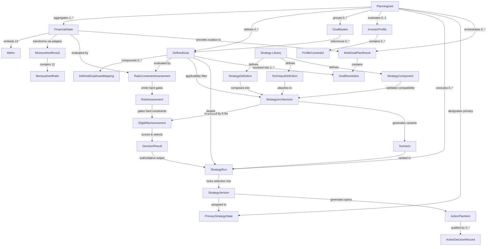

# Knowledge Graph Model: Canonical Domain Graph & Relationships

> **Document Status:** Authoritative Audit & Target Architecture  
> **Source Primary Reference:** `docs/domain-ontology/CODE_FIRST_DOMAIN_ONTOLOGY.md`  
> **Audit Scope:** Across `backend/models/`, `backend/library/`, `backend/engines/`, `backend/rules/`, `backend/services/`  
> **Core Principle:** Code-first truth. Every node, edge, and cardinality verified against actual source code implementations.

---

## 1. Domain Knowledge Graph Topology

The domain ontology connects raw financial telemetry, goals, constraints, reusable strategy knowledge, decision authority, and execution action plans into an integrated knowledge graph.

---

## 2. Canonical Nodes & Entity Evidence

| Node Label | Entity Type | Persistence / Memory Representation | Code Location Evidence | Status |
|---|---|---|---|---|
| **`PlanningUnit`** | Root Boundary | Scope container (`family` vs `individual`) | [`models/financial_state.py:12`](file:///C:/Users/lenovo/.gemini/antigravity/scratch/planvesto/backend/models/financial_state.py#L12) [`schemas/base.py`](file:///C:/Users/lenovo/.gemini/antigravity/scratch/planvesto/backend/schemas/base.py) | `CANONICAL` |
| **`FinancialState`** | Aggregate Root | Snapshot Table `financial_state_snapshots` | [`models/financial_state.py:11`](file:///C:/Users/lenovo/.gemini/antigravity/scratch/planvesto/backend/models/financial_state.py#L11) | `CANONICAL` |
| **`Metric`** | Value Object | Embedded inside `FinancialState` | [`models/financial_state.py:5`](file:///C:/Users/lenovo/.gemini/antigravity/scratch/planvesto/backend/models/financial_state.py#L5) | `CANONICAL` |
| **`MoneywheelResult`** | Diagnostic Aggregate | Table `moneywheel_snapshots` | [`models/moneywheel.py:47`](file:///C:/Users/lenovo/.gemini/antigravity/scratch/planvesto/backend/models/moneywheel.py#L47) | `CANONICAL` |
| **`DefinedGoal`** | Versioned Entity | Table `defined_goals` | [`models/defined_goal.py:20`](file:///C:/Users/lenovo/.gemini/antigravity/scratch/planvesto/backend/models/defined_goal.py#L20) | `CANONICAL` |
| **`DefinedGoalAssetMapping`** | Link Entity | Table `defined_goal_asset_mappings` | [`models/defined_goal.py:5`](file:///C:/Users/lenovo/.gemini/antigravity/scratch/planvesto/backend/models/defined_goal.py#L5) | `CANONICAL` |
| **`GoalBasket`** | Grouping Entity | In-Memory / Planned Table `goal_baskets` | [`models/goal_basket.py:6`](file:///C:/Users/lenovo/.gemini/antigravity/scratch/planvesto/backend/models/goal_basket.py#L6) | `CANONICAL` |
| **`RuleAssessment`** | Value Object | Transient engine evaluation | [`engines/rules/engine.py:36`](file:///C:/Users/lenovo/.gemini/antigravity/scratch/planvesto/backend/engines/rules/engine.py#L36) | `IMPLICIT` |
| **`StrategyDefinition`** | Knowledge Catalog | Static Python Catalog | [`models/strategy.py:57`](file:///C:/Users/lenovo/.gemini/antigravity/scratch/planvesto/backend/models/strategy.py#L57) [`library/strategies/catalog.py`](file:///C:/Users/lenovo/.gemini/antigravity/scratch/planvesto/backend/library/strategies/catalog.py) | `CANONICAL` |
| **`TechniqueDefinition`** | Knowledge Catalog | Static Python Catalog | [`models/strategy.py:47`](file:///C:/Users/lenovo/.gemini/antigravity/scratch/planvesto/backend/models/strategy.py#L47) [`library/strategies/techniques.py`](file:///C:/Users/lenovo/.gemini/antigravity/scratch/planvesto/backend/library/strategies/techniques.py) | `CANONICAL` |
| **`StrategyComponent`** | Contract VO | Dual Declaration in models and engines | [`models/strategy.py:198`](file:///C:/Users/lenovo/.gemini/antigravity/scratch/planvesto/backend/models/strategy.py#L198) [`engines/strategy/components/contracts.py:14`](file:///C:/Users/lenovo/.gemini/antigravity/scratch/planvesto/backend/engines/strategy/components/contracts.py#L14) | `DUPLICATED` |
| **`StrategyArchitecture`**| Value Object | Composed in `StrategyEngine` | [`models/strategy.py:109`](file:///C:/Users/lenovo/.gemini/antigravity/scratch/planvesto/backend/models/strategy.py#L109) | `CANONICAL` |
| **`Scenario`** | Value Object | Generated simulation variant | [`models/strategy.py:120`](file:///C:/Users/lenovo/.gemini/antigravity/scratch/planvesto/backend/models/strategy.py#L120) | `CANONICAL` |
| **`EligibilityAssessment`**| Value Object | Transient 8-fit evaluation result | [`engines/strategy/eligibility.py:23`](file:///C:/Users/lenovo/.gemini/antigravity/scratch/planvesto/backend/engines/strategy/eligibility.py#L23) | `CANONICAL` |
| **`DecisionResult`** | Value Object | Strategy selection decision | [`engines/strategy/decision.py:35`](file:///C:/Users/lenovo/.gemini/antigravity/scratch/planvesto/backend/engines/strategy/decision.py#L35) | `CANONICAL` |
| **`StrategyRun`** | Entity Container | Table `strategy_runs` | [`models/strategy.py:170`](file:///C:/Users/lenovo/.gemini/antigravity/scratch/planvesto/backend/models/strategy.py#L170) | `CANONICAL` |
| **`StrategyVersion`** | Versioned Entity | Table `strategy_versions` | [`models/strategy_version.py:10`](file:///C:/Users/lenovo/.gemini/antigravity/scratch/planvesto/backend/models/strategy_version.py#L10) | `CANONICAL` |
| **`PrimaryStrategyState`**| Singleton Pointer | Table `primary_strategy_state` | [`models/primary_strategy_state.py:7`](file:///C:/Users/lenovo/.gemini/antigravity/scratch/planvesto/backend/models/primary_strategy_state.py#L7) | `CANONICAL` |
| **`ActionPlanItem`** | Entity | Table `action_plan_items` | [`models/action_plan.py:11`](file:///C:/Users/lenovo/.gemini/antigravity/scratch/planvesto/backend/models/action_plan.py#L11) | `CANONICAL` |
| **`ActionDecisionRecord`**| Audit Entity | Table `action_decision_records` | [`models/action_plan.py:47`](file:///C:/Users/lenovo/.gemini/antigravity/scratch/planvesto/backend/models/action_plan.py#L47) | `CANONICAL` |
| **`MultiGoalPlanResult`** | Aggregate Entity | Transient Multi-Goal Plan Result | [`engines/orchestration/models.py:49`](file:///C:/Users/lenovo/.gemini/antigravity/scratch/planvesto/backend/engines/orchestration/models.py#L49) | `CANONICAL` |
| **`GoalResolution`** | Value Object | Row in `MultiGoalPlanResult` | [`engines/orchestration/models.py:29`](file:///C:/Users/lenovo/.gemini/antigravity/scratch/planvesto/backend/engines/orchestration/models.py#L29) | `CANONICAL` |

---

## 3. Explicit Relationship Semantics & Cardinality

1. **`PlanningUnit` (1) ──* (`FinancialState`):**
   - A planning unit accumulates an immutable historical series of financial snapshots over time.
2. **`FinancialState` (1) ── (1) `MoneywheelResult`:**
   - Evaluated 1:1 via [`MoneywheelFinancialStateAdapter`](file:///C:/Users/lenovo/.gemini/antigravity/scratch/planvesto/backend/engines/moneywheel/financial_state_adapter.py#L7-L36).
3. **`DefinedGoal` (1) ──* (`DefinedGoalAssetMapping`):**
   - A goal can compound zero, one, or multiple existing assets toward its target.
4. **`DefinedGoal` (1) ── (1) `StrategyRun`:**
   - A strategy run evaluates a specific defined goal version against all applicable strategies.
5. **`StrategyArchitecture` (1) ──* (`StrategyDefinition`):**
   - Composed of exactly 1 primary strategy definition and 0 or more supporting strategy definitions.
6. **`StrategyArchitecture` (1) ── (1) `EligibilityAssessment`:**
   - Gated by evaluating all 8 eligibility fits.
7. **`DecisionResult` (1) ── (1) `StrategyRun`:**
   - Authoritative selection outcome embedded directly into the run record.
8. **`StrategyVersion` (1) ──* (`ActionPlanItem`):**
   - Once an investor confirms a strategy version, [`rules/action_plan.py:build_action_specs`](file:///C:/Users/lenovo/.gemini/antigravity/scratch/planvesto/backend/rules/action_plan.py#L10) generates executable action plan items.
9. **`ActionPlanItem` (1) ──* (`ActionDecisionRecord`):**
   - Every status modification or execution event appends an immutable decision record.
10. **`MultiGoalPlanResult` (1) ──* (`GoalResolution`):**
    - Partitions monthly surplus across multiple defined goals in priority order.

---

## 4. Current Implementation vs. Target Canonical Model

### Current Implementation:
- Relationships are cleanly defined in code via Pydantic model identifiers (`planning_unit_id`, `goal_id`, `strategy_version_id`).
- However, knowledge models are partially split between `models/` and `engines/` (e.g. `StrategyComponent` duplicated, `RuleAssessment` misplaced in `engines/rules/engine.py`).

### Target Canonical Model:
- **Consolidated Model Package:** All graph node types live exclusively under `backend/models/`.
- Strict typing on foreign key relationships with clear Pydantic validation.

---

## 5. Gaps & Refactoring Implications

1. **Eliminate Contract Duplication:** Delete `StrategyComponent` in `models/strategy.py:198` and re-export the canonical class from `engines/strategy/components/contracts.py:14`.
2. **Move Rule Models:** Relocate `RuleAssessment` and `RuleResult` from `engines/rules/engine.py` to `models/rule_assessment.py`.
3. **Add Basket Persistence:** Implement `GoalBasketRepository` in `backend/data/goal_basket_repository.py` to persist `GoalBasket` nodes.
