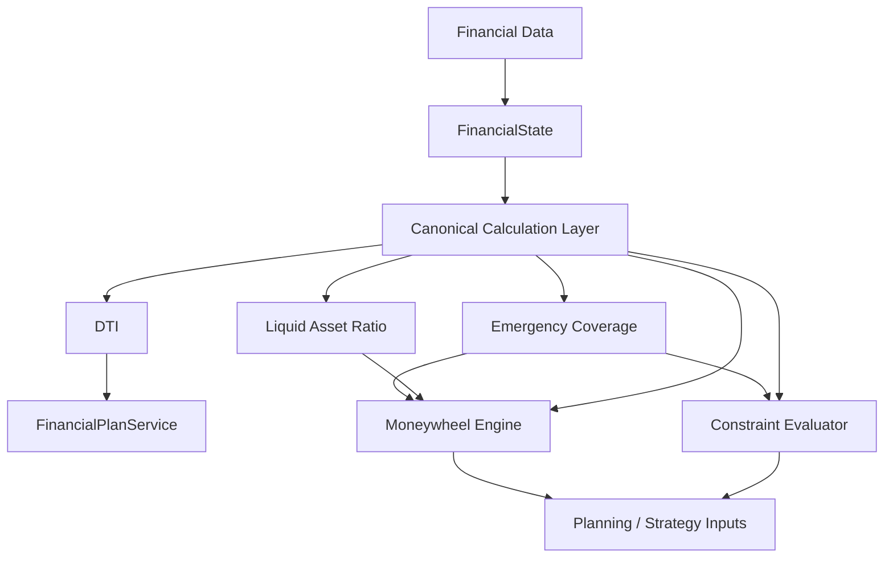

# Financial Semantics Dependency Graph

```mermaid
flowchart TD
    A["Financial Data"] --> B["FinancialState"]
    B --> C["Canonical Calculation Layer"]
    C --> D["DTI"]
    C --> E["Emergency Coverage"]
    C --> F["Liquid Asset Ratio"]
    D --> G["FinancialPlanService"]
    E --> H["Moneywheel Engine"]
    E --> I["Constraint Evaluator"]
    F --> H
    C --> H
    C --> I
    H --> J["Planning / Strategy Inputs"]
    I --> J
```
