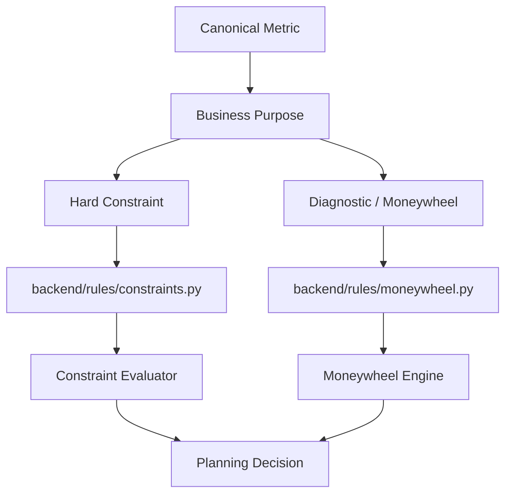

# Threshold Ownership Dependency Graph

```mermaid
flowchart TD
    A["Canonical Metric"] --> B["Business Purpose"]
    B --> C["Hard Constraint"]
    B --> D["Diagnostic / Moneywheel"]
    C --> E["backend/rules/constraints.py"]
    D --> F["backend/rules/moneywheel.py"]
    E --> G["Constraint Evaluator"]
    F --> H["Moneywheel Engine"]
    G --> I["Planning Decision"]
    H --> I
```
