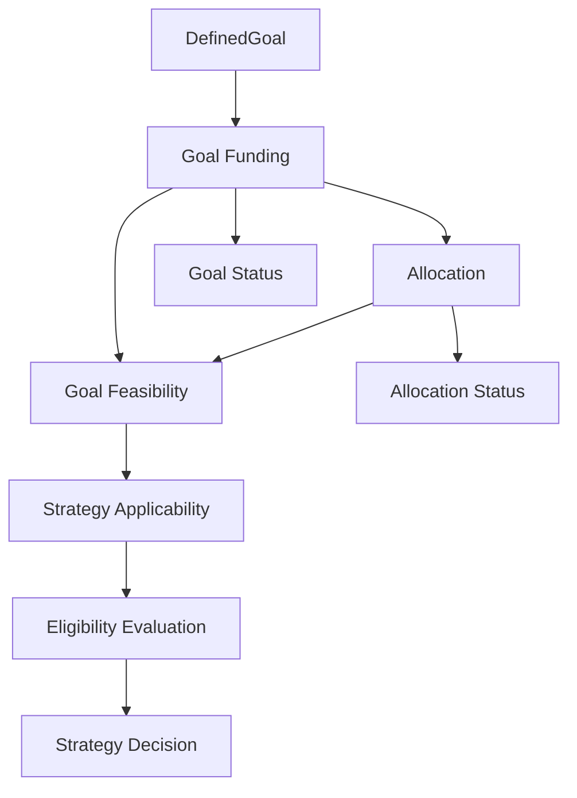

# Goal Funding → Feasibility → Eligibility Dependency Graph

```mermaid
flowchart TD
    A["DefinedGoal"] --> B["Goal Funding"]
    B --> C["Allocation"]
    B --> D["Goal Feasibility"]
    C --> D
    D --> E["Strategy Applicability"]
    E --> F["Eligibility Evaluation"]
    F --> G["Strategy Decision"]
    B --> H["Goal Status"]
    C --> I["Allocation Status"]
```
