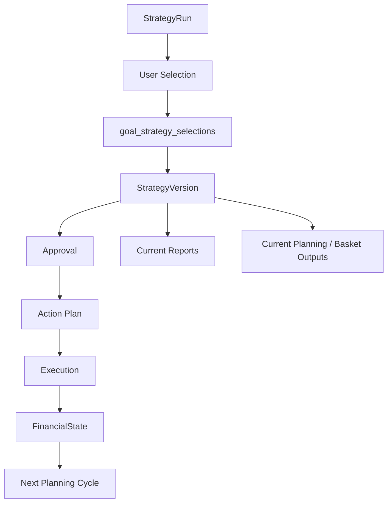

# Strategy Decision Dependency Graph

```mermaid
flowchart TD
    A["StrategyRun"] --> B["User Selection"]
    B --> C["goal_strategy_selections"]
    C --> D["StrategyVersion"]
    D --> E["Approval"]
    E --> F["Action Plan"]
    F --> G["Execution"]
    G --> H["FinancialState"]
    H --> I["Next Planning Cycle"]
    D --> J["Current Reports"]
    D --> K["Current Planning / Basket Outputs"]
```
