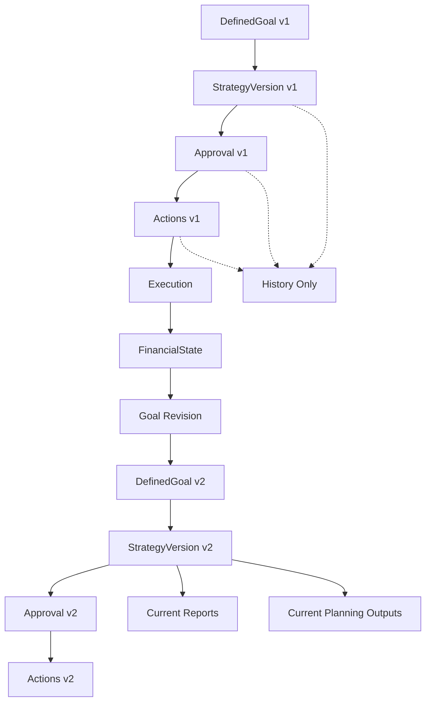

# Goal Revision → StrategyVersion Dependency Graph

```mermaid
flowchart TD
    A["DefinedGoal v1"] --> B["StrategyVersion v1"]
    B --> C["Approval v1"]
    C --> D["Actions v1"]
    D --> E["Execution"]
    E --> F["FinancialState"]
    F --> G["Goal Revision"]
    G --> H["DefinedGoal v2"]
    H --> I["StrategyVersion v2"]
    I --> J["Approval v2"]
    J --> K["Actions v2"]
    I --> L["Current Reports"]
    I --> M["Current Planning Outputs"]
    B -.-> N["History Only"]
    C -.-> N
    D -.-> N
```
