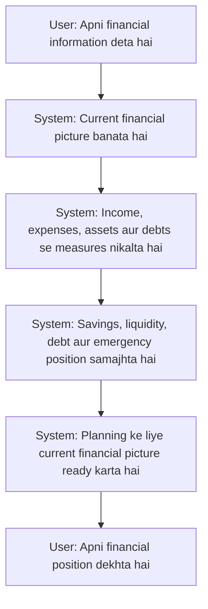

# 1. Your Financial Picture

```mermaid
flowchart TD
    A["User: Apni financial information deta hai"] --> B["System: Current financial picture banata hai"]
    B --> C["System: Income, expenses, assets aur debts se measures nikalta hai"]
    C --> D["System: Savings, liquidity, debt aur emergency position samajhta hai"]
    D --> E["System: Planning ke liye current financial picture ready karta hai"]
    E --> F["User: Apni financial position dekhta hai"]
```
