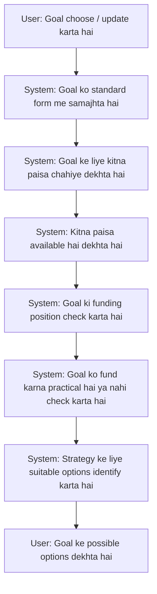

# 2. Your Goal

```mermaid
flowchart TD
    A["User: Goal choose / update karta hai"] --> B["System: Goal ko standard form me samajhta hai"]
    B --> C["System: Goal ke liye kitna paisa chahiye dekhta hai"]
    C --> D["System: Kitna paisa available hai dekhta hai"]
    D --> E["System: Goal ki funding position check karta hai"]
    E --> F["System: Goal ko fund karna practical hai ya nahi check karta hai"]
    F --> G["System: Strategy ke liye suitable options identify karta hai"]
    G --> H["User: Goal ke possible options dekhta hai"]
```
