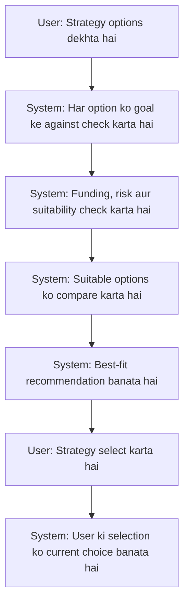

# 3. Choose a Strategy

```mermaid
flowchart TD
    A["User: Strategy options dekhta hai"] --> B["System: Har option ko goal ke against check karta hai"]
    B --> C["System: Funding, risk aur suitability check karta hai"]
    C --> D["System: Suitable options ko compare karta hai"]
    D --> E["System: Best-fit recommendation banata hai"]
    E --> F["User: Strategy select karta hai"]
    F --> G["System: User ki selection ko current choice banata hai"]
```
