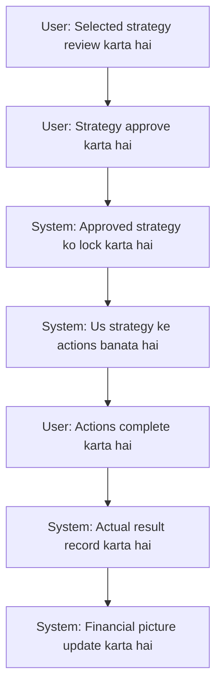

# 4. Approve and Act

```mermaid
flowchart TD
    A["User: Selected strategy review karta hai"] --> B["User: Strategy approve karta hai"]
    B --> C["System: Approved strategy ko lock karta hai"]
    C --> D["System: Us strategy ke actions banata hai"]
    D --> E["User: Actions complete karta hai"]
    E --> F["System: Actual result record karta hai"]
    F --> G["System: Financial picture update karta hai"]
```
