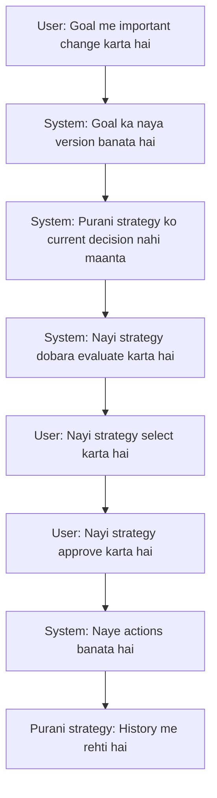

# 5. Change Your Goal

```mermaid
flowchart TD
    A["User: Goal me important change karta hai"] --> B["System: Goal ka naya version banata hai"]
    B --> C["System: Purani strategy ko current decision nahi maanta"]
    C --> D["System: Nayi strategy dobara evaluate karta hai"]
    D --> E["User: Nayi strategy select karta hai"]
    E --> F["User: Nayi strategy approve karta hai"]
    F --> G["System: Naye actions banata hai"]
    G --> H["Purani strategy: History me rehti hai"]
```
